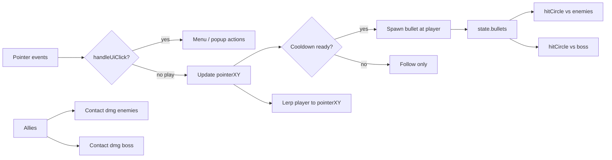

# feat: Mouse-follow controls and code-drawn energy bullets

## Goal Capsule

**Objective:** In the web playable rebuild, the bacteria freely follows the pointer in XY; click fires upward energy bullets drawn as canvas glow circles (no new sprites); ally contact damage stays.

**Authority:** This plan > session-settled control/combat decisions > existing `web/game.js` patterns > original Unity hold-to-fly fantasy (deliberately superseded for controls).

**Stop when:** Levels 1–3 playable with free follow + upward glow shots + ally melee; hold/release-to-die paths and copy removed; README/`index.html` hint/instruct text match; `window.__nwo` supports the new input contract.

**Execution profile:** Smoke-first browser verification (`web/serve.sh` + console harness). No automated unit suite exists.

**Product Contract preservation:** N/A — bootstrapped in this plan (`product_contract_source: ce-plan-bootstrap`).

---

## Product Contract

### Summary

Replace hold-to-fly / release-to-die with free mouse (and touch) follow plus click-to-shoot energy bullets. Bullets are code-drawn glow circles traveling straight up the tunnel. Player shots and ally melee both deal damage. Update player-facing copy so instructions match the new controls.

### Problem Frame

The web rebuild currently mirrors the original hold-to-fly model. The desired feel is a freer twin-stick-lite vertical shooter: steer anywhere in the play bounds and fire upward. Dedicated bullet sprites were rejected in favor of canvas glow circles so no new art is required.

### Requirements

- **R1.** During `play`, the player continuously follows the pointer in world XY, clamped to existing play bounds (X ≈ `[-2.2, 2.2]`, Y ≈ `[-5, 5]`).
- **R2.** Hold-to-fly, gravity fall, and release-to-die are removed. Leaving the pointer up does not kill the player.
- **R3.** Primary click/tap in `play` (after UI click handling) spawns an energy bullet at the player that travels straight up the tunnel (increasing world Y).
- **R4.** Bullets are drawn as canvas glow circles (radial gradient / soft glow). No new files under `web/assets/frames/`; do not reuse `anti_*` as player projectiles.
- **R5.** Bullets damage enemies and the boss via `hitCircle`; they do not collect food or collide with obstacles/walls/allies/player.
- **R6.** Ally contact damage against enemies and boss remains as today (cooldown + damage values unchanged).
- **R7.** Fire rate is limited with a ~0.2s cooldown so click spam cannot machine-gun or overwhelm the frame budget. Default bullet damage ~2; boss hits use a reduced factor (~0.35×) similar to ally boss melee.
- **R8.** Player-facing copy (in-game instruct/splash/play hint, `web/index.html` hint, README how-to-play) describes mouse-follow + click-to-shoot, not hold/release.
- **R9.** Spawn `grace` remains contact invulnerability only (no fall logic).

### Actors

- **A1.** Player (bacteria) — steers and shoots.
- **A2.** Allies — follow offsets; melee on contact.
- **A3.** Antibodies / boss — take bullet and ally damage; contact still kills the player after grace.

### Key Flows

- **F1.** Enter level → pointer moves → player lerps to pointer within clamps.
- **F2.** Click/tap in play → bullet spawns → travels +Y → hits enemy/boss or despawns off-screen.
- **F3.** Ally near enemy → contact damage with cooldown (unchanged).
- **F4.** Level 1 (no allies) → player can still damage/clear antibodies with bullets alone.

### Acceptance Examples

- **AE1.** When the pointer moves to a clamped corner, the player arrives near that corner without falling or dying from releasing input.
- **AE2.** When the player clicks in play, a glow bullet appears and moves upward; an antibody in its path loses HP / dies.
- **AE3.** When allies are present, they still damage enemies on contact while bullets also deal damage.
- **AE4.** When a win/dead popup is showing, clicking Replay/Next/Exit does not spawn bullets.
- **AE6.** Glow bullets read as bright cyan/white cores with a soft halo against the dark tunnel background during mid-scroll play.
- **AE5.** On Level 3, bullets reduce boss HP; surviving `bossLife` or reducing HP to 0 still wins.

### Success Criteria

- Controls feel responsive; upward shots read clearly against the scrolling tunnel.
- Level 1 is completable without allies using bullets + dodging.
- Ally economy (food → points → spawn) still matters alongside shooting.
- No hold/release language remains in primary player surfaces.

### Scope Boundaries

**In scope**

- `web/game.js` control, bullet, collision, draw, harness changes
- Copy updates in splash/instruct/play HUD, `web/index.html`, `README.md`
- Light note in the existing web-rebuild solution doc if it still asserts hold-to-fly as current behavior

**Out of scope / deferred**

- Unity C# restore or new Unity prefabs
- New sprite assets or cropping bullet art from `anti.png` / `effect_*.png`
- Retuning level timers / `enemyChance` beyond light bullet damage/cooldown choices
- Aim-toward-cursor or nearest-enemy targeting
- Separate mobile shoot button / twin-stick virtual pad

### Deferred to Follow-Up Work

- Optional balance pass if dual DPS makes L2/L3 too easy after playtest
- Dedicated `docs/solutions/code-implementation/` note for projectile patterns (nice-to-have after ship)

---

## Planning Contract

### Key Technical Decisions

1. **Code-drawn glow bullets** — radial gradient / soft circle in world space via `worldToScreen`; no sprite load. `(session-settled: user-directed — chosen over crop anti.png green orbs or tint effect_02)`
2. **Free XY mouse-follow + click-to-shoot** — replace `state.holding` / gravity / release death. `(session-settled: user-directed — chosen over keep hold-to-fly and only add shooting)`
3. **Bullets travel straight up the tunnel** — constant positive world `vy` (same axis convention as enemy descent). `(session-settled: user-directed — chosen over aim-at-cursor or nearest-enemy)`
4. **Dual offense** — player bullets + existing ally melee both deal damage. `(session-settled: user-approved — agent-selected over replace-ally-melee so the ally spawn economy still matters)`
5. **Fire gate** — per-shot cooldown (~0.18–0.25s) and modest bullet damage (~2; boss hits use a reduced factor similar to ally `* 0.35`) so Level 1 is viable and Level 3 is not trivial.
6. **Pointerdown semantics** — after `handleUiClick` returns false in `play`, update pointer target and attempt fire (subject to cooldown). Primary button / primary touch only (`button === 0`). Combined reposition+fire on the same down is intentional (no separate shoot control). Pointermove always updates XY while in `play` (desktop hover-follow; touch steers while the finger is down).
7. **Pointer leave** — keep last pointer world position (no auto-death, no recenter).
8. **Grace** — keep as spawn contact invuln; firing during grace is allowed.
9. **Harness** — replace `window.__nwo.hold` with pointer + fire helpers for console smoke.
10. **Bullet lifecycle defaults** — destroy on first enemy/boss hit (no pierce); cull when `y > 7` so shots can reach the spawn band above the player; clear `state.bullets` on kill/win as well as `resetPlay`.

### High-Level Technical Design



World axis: increasing Y is up the tunnel / deeper into the body. Enemies scroll with negative Y; bullets advance with positive Y.

### Assumptions

- Existing X/Y clamps from the web rebuild remain good enough without retuning obstacle geometry.
- Canvas `{ alpha: false }` still allows readable glow via bright radial fills (verify visually; fall back to multi-ring fills if `shadowBlur` looks weak).
- Desktop: hover-follow via pointermove. Touch: drag to steer; tap repositions and may fire (subject to cooldown). Multi-touch secondary fingers ignored (current `eventToCanvas` first-touch pattern).

### Implementation Constraints

- Stay inside the thin Canvas IIFE in `web/game.js`; no bundler, no new dependencies.
- Preserve screen flow, levels config, food/points/ally spawn, obstacle pairs, boss timer win path.
- DOX: update nearest player-facing docs when control contract changes (`README.md`, in-game strings, `index.html` hint). Prefer updating the web-rebuild solution doc only where it still claims hold-to-fly as current behavior.

### Sequencing

1. U1 — control model migration (follow + remove hold/fall)
2. U2 — bullets (spawn/update/draw/collision)
3. U3 — copy, harness, DOX surfaces

### Sources & Research

- Local patterns: `web/game.js` (pointer handlers, `updatePlay`, `hitCircle`, ally melee loops, `window.__nwo`)
- Institutional: `docs/solutions/tooling-decisions/unity-missing-scripts-web-rebuild.md` (fantasy-over-fidelity web rebuild; scripts absent)
- External research: skipped — strong local patterns; bullet rendering approach settled without library choice

---

## Implementation Units

### U1. Free mouse-follow control model

**Goal:** Player follows pointer XY in play; hold/fall/release-death removed; grace is contact-only.

**Requirements:** R1, R2, R9; F1; AE1

**Dependencies:** None

**Files:**
- Modify: `web/game.js`

**Approach:**
- Track `pointerX` and `pointerY` (clamped) on pointerdown/move in `play` without a `holding` gate — ungate `onPointerMove` so touch drag works.
- In `updatePlay`, lerp player toward both axes (symmetric or near-symmetric rates); drop `p.vy` gravity and the `y < -5.5` kill path.
- Remove or stop writing `state.holding` in handlers, `killPlayer`, and `resetPlay`.
- Initialize pointer target to player position on `resetPlay` so the first frame does not yank to an unset pointer.
- Keep `grace` checks only for contact damage (enemies/obstacles/boss).

**Execution note:** Smoke-first — verify in browser before adding bullets so follow alone feels right.

**Patterns to follow:** Existing lerp `p.x += (target - p.x) * Math.min(1, k * dt)` and clamp helpers; `eventToCanvas` / `canvasToWorld`.

**Test scenarios:**
- Happy path: move pointer across the canvas during play → player tracks within clamps on both axes.
- Edge: release pointer / lift finger → player stays alive at last follow position (no fall death).
- Edge: level start before any move → player does not jump to (0,0) unexpectedly if pointer was elsewhere; target initializes to player spawn.
- Integration: after grace expires, enemy contact still kills; during grace, contact does not.

**Verification:** Level 1 can be steered freely with mouse and touch without holding; release never triggers the old death message.

---

### U2. Upward glow energy bullets

**Goal:** Click/tap fires rate-limited glow bullets that travel +Y and damage enemies/boss; ally melee unchanged.

**Requirements:** R3, R4, R5, R6, R7; F2, F3, F4; AE2, AE3, AE4, AE5, AE6

**Dependencies:** U1

**Files:**
- Modify: `web/game.js`

**Approach:**
- Add `state.bullets` cleared in `resetPlay`, `killPlayer`, and `winLevel`; `fireCooldown` on state (~0.2s).
- On play pointerdown (post-UI, primary button only), update pointer target and spawn bullet at player with upward speed (~8–12 world units/s), small radius, damage ~2; apply cooldown. Combined reposition+fire is intentional.
- Update bullets each frame: `y += speed * dt`; cull when `y > 7`; `hitCircle` vs enemies then boss; destroy bullet on first hit (no pierce). Boss damage ≈ bullet dmg × 0.35.
- Draw with `drawGlowBullet` (bright cyan/white core + soft halo via radial gradient / layered arcs) in `drawPlay` after enemies/obstacles and immediately before the player sprite.
- U2 owns the no-fire-on-popup guard (`screen === "play"` + `handleUiClick` early return); U3 only verifies it via smoke/harness.
- Do not run bullet sim when `screen !== "play"`.
- Leave ally melee loops intact.

**Patterns to follow:** Entity array + filter-dead pattern used by foods/enemies; `hitCircle`; boss ally damage factor as a reference for bullet-vs-boss scaling.

**Test scenarios:**
- Happy path: click spawns upward glow projectile that leaves the top of the view if nothing is hit.
- Happy path: bullet overlapping an antibody reduces HP / removes it when HP ≤ 0.
- Happy path: Level 1 with no allies can clear at least one antibody via bullets.
- Integration: allies still apply contact damage while bullets also deal damage in the same level.
- Integration: bullets reduce boss HP on Level 3; boss timer win (`life <= 0`) still works.
- Edge: rapid clicking respects cooldown (no unbounded bullet count per second).
- Edge: bullets passing through food do not grant points; walls/obstacles ignore bullets.
- Edge: popup visible → UI click does not spawn bullets (AE4; may need U3 harness to assert).
- Error/failure: `dt` spike near cap does not leave immortal stuck bullets (cull + hit still progress).

**Verification:** Visual glow readable on the tunnel background; L1/L2/L3 combat works with dual offense; no new asset files added.

---

### U3. Copy, harness, and DOX sync

**Goal:** All player-facing control language and the console harness match the new model.

**Requirements:** R8; AE4

**Dependencies:** U1, U2

**Files:**
- Modify: `web/game.js` (splash/instruct/play hint strings, `window.__nwo`, kill messages)
- Modify: `web/index.html` (`#hint`)
- Modify: `README.md` (play / how-to-play)
- Modify: `docs/solutions/tooling-decisions/unity-missing-scripts-web-rebuild.md` (only where it still describes hold-to-fly as current web behavior)

**Approach:**
- Replace hold/release language with follow + click-to-shoot wording.
- Replace play HUD `"HOLD to invade"` with a short cue such as `"Move to steer · Click to shoot"` (may fade after grace).
- Replace splash tagline / instruct step 4 / kill messages that mention releasing finger; keep ally/food rules intact.
- Extend `__nwo`: e.g. `setPointer(wx, wy)`, `fire()`, keep/adapt `click` for UI; remove or no-op `hold` with a clear comment if anything external might call it (none in-repo today).
- DOX pass: README + solution doc control sentences stay consistent with shipped behavior.

**Execution note:** Prefer install/runtime smoke over unit coverage.

**Test scenarios:**
- Happy path: instruct screen and README no longer mention releasing finger to die.
- Happy path: `__nwo.startLevel(1); __nwo.setPointer(...); __nwo.fire()` creates a bullet in state (inspect via a small getter if added, or visual).
- Integration: from dead/win popup, `__nwo.click` / UI buttons still navigate without firing bullets into a non-play screen.
- Edge: hint under canvas matches in-game instructions.

**Verification:** Grep-equivalent mental check — no remaining “hold to fly” / “don’t release” in `web/` player surfaces and README how-to-play; harness drives follow + fire without `hold`.

---

## Verification Contract

**Primary gate (required):**

```bash
cd web && ./serve.sh
```

Open `http://127.0.0.1:8765/` and exercise:

1. Splash → Map → Level 1: free XY follow; no release death.
2. Click fires upward glow bullets; antibodies take damage.
3. Level 2: allies still melee; bullets also work.
4. Level 3: bullets hit boss; survive or deplete HP to win.
5. Instruct / hint / README language matches new controls.
6. Console: `__nwo.startLevel(1)` plus new pointer/fire helpers behave.

**Automated unit/integration suite:** none in repo — do not invent a framework in this plan.

**Quality bar:** No new sprite assets; no regressions to food/points/ally spawn/progress save; abandoned hold-state code removed from the live path.

---

## Definition of Done

- [ ] U1–U3 complete with their verification outcomes
- [ ] R1–R9 satisfied; AE1–AE6 observed in manual smoke
- [ ] Dual offense works; ally melee loops untouched in behavior
- [ ] Player-facing copy and README updated; solution doc not contradicting shipped controls
- [ ] No dead hold/fall code left on the play path; no unused bullet prototypes left in the diff
- [ ] Ready for playtest balance follow-up only if dual DPS feels trivial (deferred, not blocking)
)
